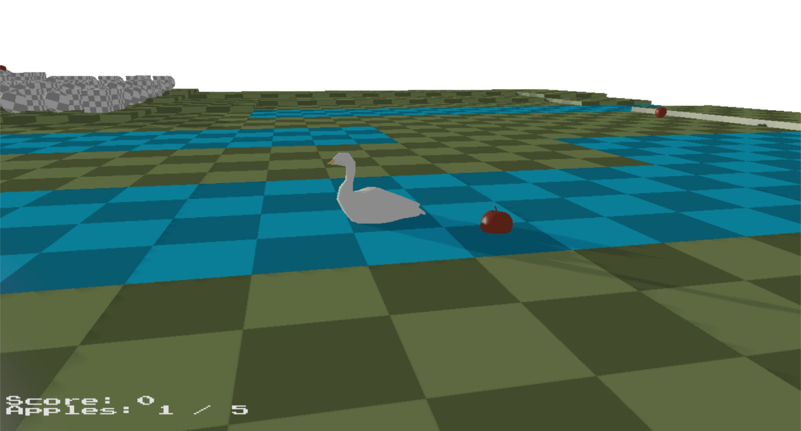
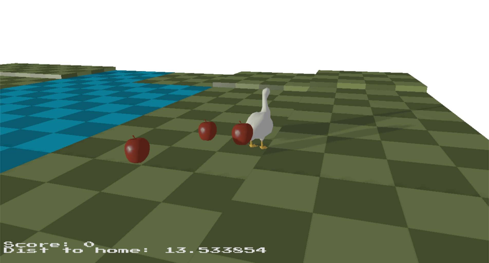
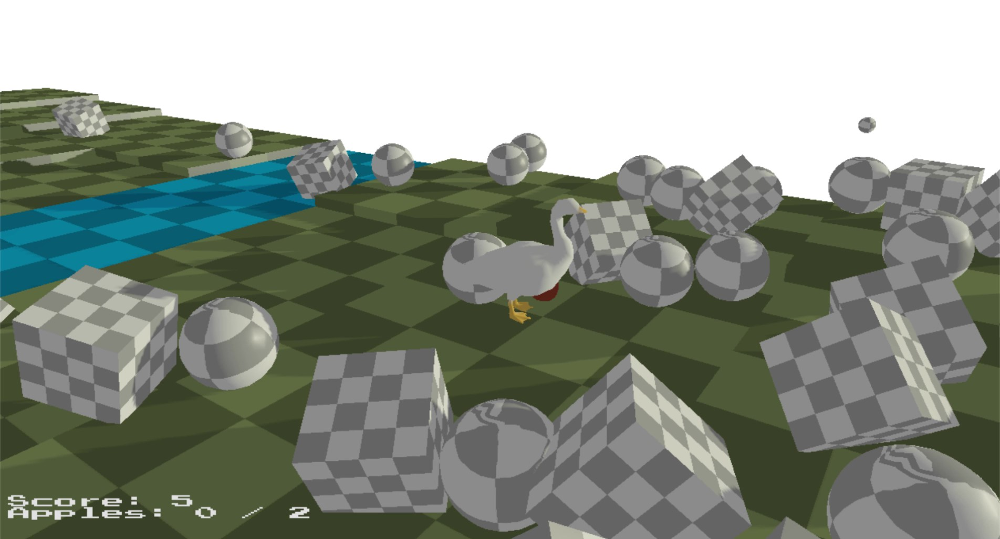
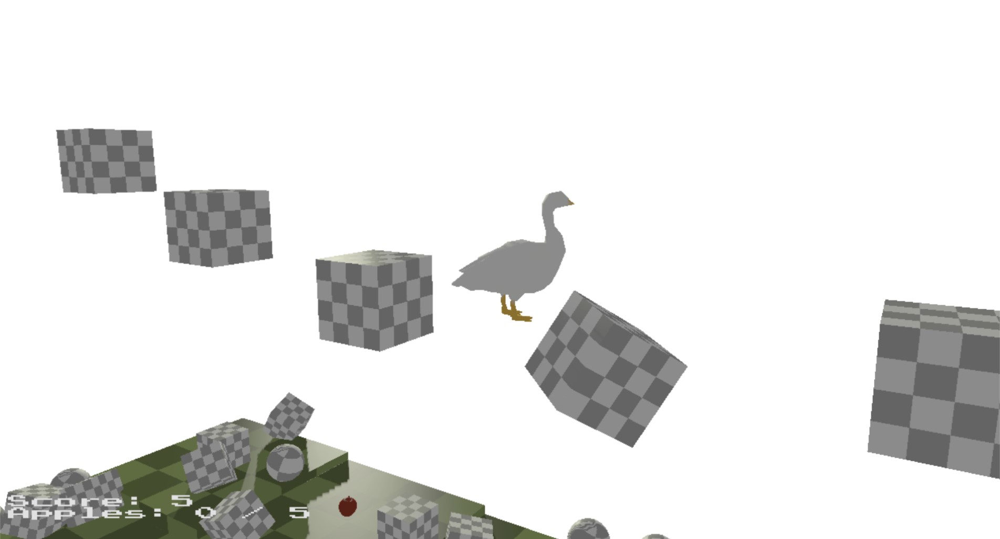
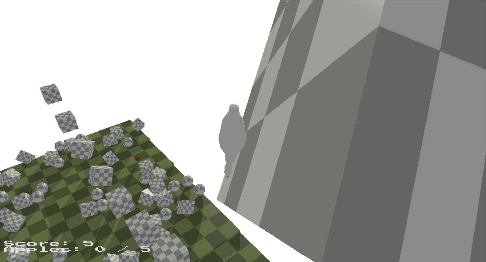
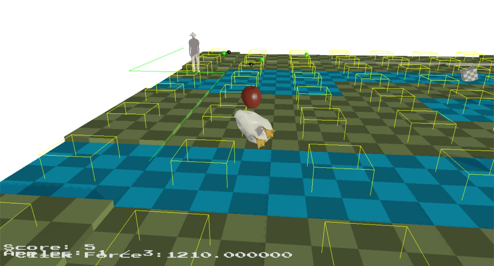
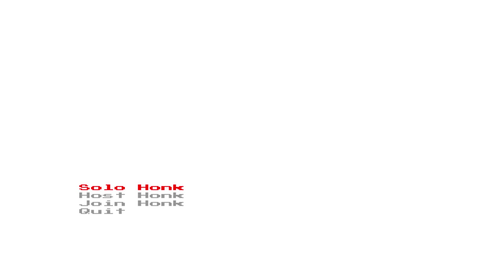
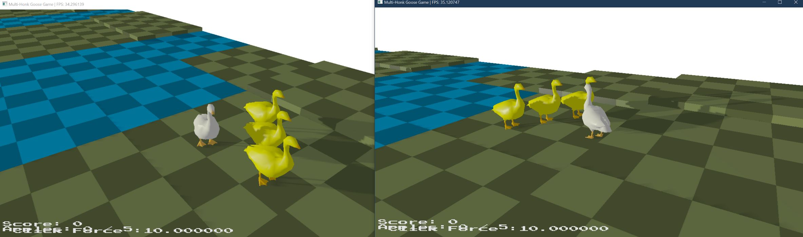

# The Unoriginal Goose Game
Showcase of various game technologies including physics, AI and netwoking.

[YouTube video](https://youtu.be/gKIVOXjSYGc)

## Water buoyancy

Spring based resolution allowing anything in the water, to raise to the top. When the AI touches water, additional upward forces are applied to allow it to "swim".

## Spring chain following the goose

Each apple in the chain, has Hooke's Law spring resolutions making it follow the previous apple. The first apple follows the goose. If any of the apples in the chain bump into the goose, there is no impulse applied to the goose.

## Angular and linear impulse resolution

When a force is applied to an object, it can either be applied to a specific point on the object, or equally in a given direction. If a force is applied on a point, the objects will rotate based on the torque applied. When the goose's velocity changes direction, torque is applied to rotate it gradually to it's new facing direction.

## Constraint-based bridge

The 2 boxes on either end of the bridge, do not move but all the boxes between them, are connected to it's neighbours through a distance constraint. When one piece moves, the other ones are effected too.

## Sphere-OBB collision

The collision volume of the goose is a sphere and when it collides with an OBB, it will collide and if it is sloped, roll down it's edge.

## AI path-finding

At any given time, the AI will be doing one of three things; If the goose is carrying any apples, the AI will find the most efficient path to the goose, chasing it. If the goose is close enough and has at least one apple, it will go directly towards the goose. If the goose has no apples, the AI will just wait. The path is not recalculated every frame, the AI follows the directions to the next checkpoint, at which point, the full path will be updated.

## Pushdown automata

The main menu is the state that the game is in when the game starts. When a menu item is chosen, it is pushed onto the stack of states. If the game state finishes, it is popped off the stack and the state at the top is displayed. If the quit option is selected, the main menu state is popped off and once the stack is empty, the application closes.

## Multiplayer

The multiplayer works through one person hosting the game and joining their hosted game on one game instance. When other clients join the server, a packet is broadcast to all members that a player has joined. When this packet is received, a yellow goose is spawned in the client's world, and that player's ID is assigned to that goose. Each player connected to a host has a unique ID number.
